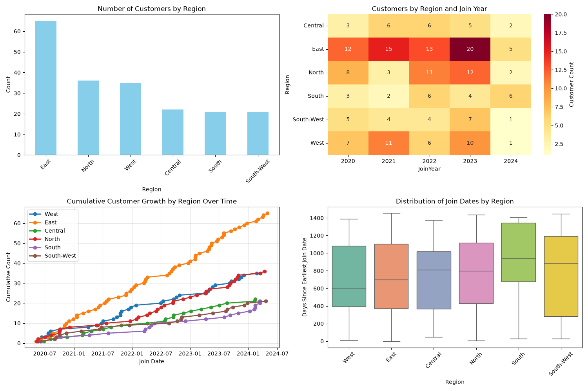
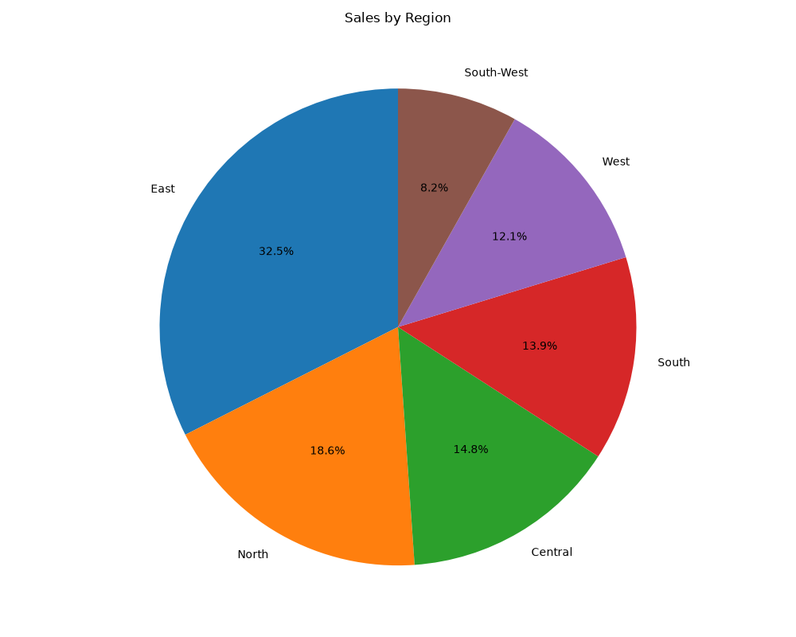
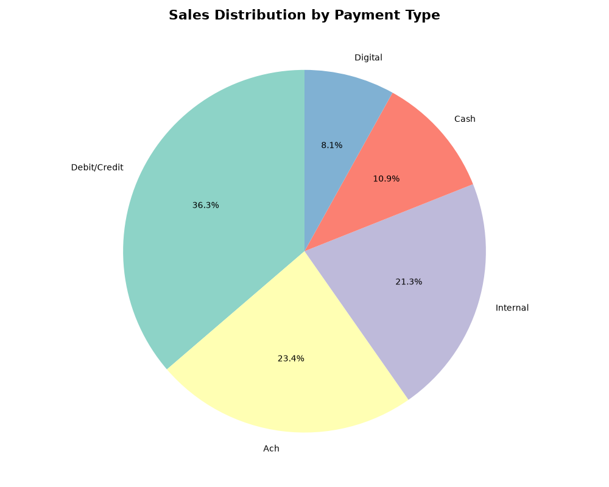
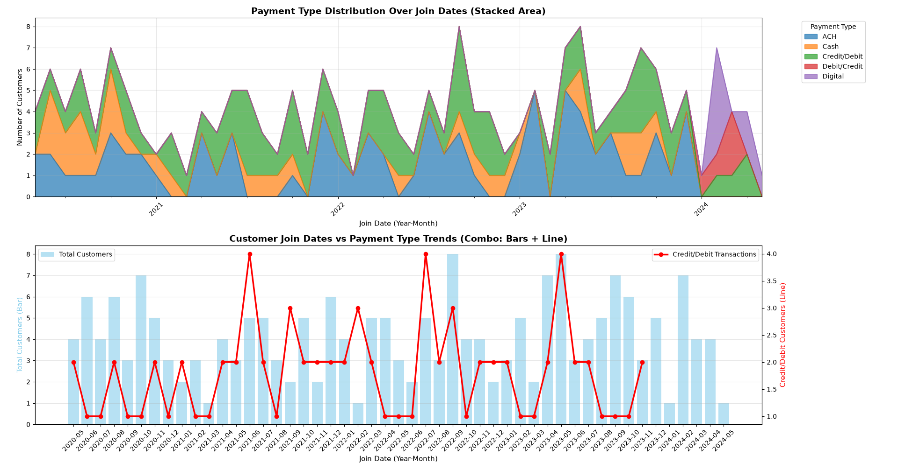

# Project Documentation

This site provides project documentation.
Use the documentation navigation to explore.

## How-To Guide

Many instructions are common to all our projects.

See
[⭐ **Workflow: Apply Example**](https://denisecase.github.io/pro-analytics-02/workflow-b-apply-example-project/)
to get the example projects running on your machine.

## Project Documentation Pages (docs/)

- **Home** - this documentation landing page
- [**Project Instructions**](./project-instructions.md)  - the standard project workflow
- [**Your Files**](./your-files.md) - how to copy the example and create your version
- [**Glossary**](./glossary.md) - project terms and concepts
- [**API**](./api.md) - autogenerated code documentation for the public project interface

## Phase 4. Technical Modification

The technical change I choose to make, was creating a graph that showed the relationship between the join rate and the regions.

I choose this change because understanding which regions have higher rates in joining can be studies to help other regions that struggle.

This was verified in project.log when it said executed successfully, but also when the code ran a new chart was generated that gave the results I had requested.

## Phase 5. Custom Project

My Phase 5 project I did, I did with the question in my head about customer payment and joining. I didn’t plan this route , but given time limits I had to change. The question I tried to answer (for the company) for this project is, should we invest in our credit card.

I used historic data to help create a bigger picture, on the payment types and when customers join. Using this data to help begin forecasting, about promotions on credit usage and becoming a new customer.

### Basis and Data

The data used is from the Customer Data file, ranging from 2020 to 2024.

The customer data has been cleaned, and updated with preferred payment type of each customer. With the idea that digital payment plan was newly added in 2024. This data sheet does not include customers from 2025, unlike the sales data.

### Warehouse Design/ELT

**Customer Table**
- CustomerID   INTEGER PRIMARY KEY
- Name         VARCHAR
- Region       VARCHAR
- JoinDate     DATE
- SpendingScore      INTEGER
- TierLevel          VARCHAR
- DefaultPaymentType VARCHAR

**Product Table**
- ProductID    INTEGER PRIMARY KEY
- ProductName  VARCHAR
- Category     VARCHAR
- UnitPrice    DOUBLE
- Availability VARCHAR
- StockQuantity  INTEGER

**Sales Table**
- TransactionID  INTEGER PRIMARY KEY
- SaleDate       DATE
- CustomerID     INTEGER
- ProductID      INTEGER
- StoreID        INTEGER
- CampaignID     INTEGER
- SaleAmount     DOUBLE
- Percent        DOUBLE
- PaymentType     VARCHAR

The datasets was cleanined and transformed. Within this process duplicates were rmeoved, formatting was streamlined, invalid values were recalucated or deleted.

A additional column was later created for Customer Dataset, and went through the same process the inital data went through.

### Summary

The project that was completed, was comparing data from 2020 to 2025 in relations to Join rates and Payment type usage.

The hope was to fiund a connection between the two, to answer the question "would it be profitable to have a company credit card."

